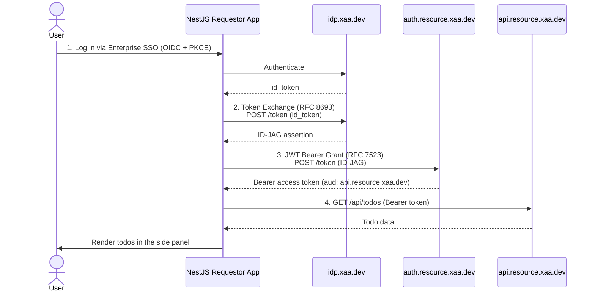

# NestJS Cross App Access (XAA) Requestor App Example

A NestJS web app demonstrating **Cross-App Access (XAA)** using the [openid-client](https://github.com/panva/openid-client) library. It acts as a requester app that fetches a user's tasks from a protected Todo resource app — with no OAuth consent screens.

In this example, the NestJS app is a requester app that fetches the To-Do list from the Todo0 Resource App and lists the tasks fetched.

Please read [Make Secure App-to-App Connections Using Cross App Access][blog] for a detailed guide through.

This app runs entirely in a browser-based [GitHub Codespace](https://github.com/features/codespaces), so no local Node install is required — just a GitHub account and a browser.

---

## Understanding the Cross-App Access flow

XAA enables one app to securely access another app's resources on behalf of the same logged-in user, without additional consent prompts. This example logs each step to the console so you can watch the token exchange, Bearer token issuance, and resource fetch happen in real time:



---

## Running app end-to-end

1. On this repo, click **Code → Codespaces → Create codespace on main**.
2. Once it opens, install dependencies and get the forwarded URL plus ready-to-use redirect URIs:

   ```sh
   npm ci
   npm run get-redirect-uri
   ```

   This outputs the Codespace's forwarded URL (e.g. `https://<codespace-name>-3000.app.github.dev`). Copy it — you'll need it in the next step.

3. Register your app on [xaa.dev](https://xaa.dev/?have=requesting&want=register&via=oidc) — it's an IdP-agnostic playground for testing Cross App Access, so you don't need an IdP account or a conformant resource app OAuth server.
   - Click **"Take me there."**
   - Enter a made-up email to continue registration.
   - You'll land on a pre-registered requesting app. Click **Edit** and set:

     | Field | Value |
     |---|---|
     | Application Name | `Notes App` (or any name you like) |
     | Redirect URIs | `<forwarded-url>/auth/callback` |
     | Post-Logout Redirect URIs | `<forwarded-url>` |

   - Under **Resource Connections**, click **Add Resource**, select **Todo0 Resource App**, leave the `todos.read` scope checked, then click **+ Add Connection**.
   - Click **Register App** (or **Save changes**). The site will then display four values: Notes App **Client ID**, Notes App **Client Secret**, Resource **Client ID**, and Resource **Client Secret** (for the resource/to-do app's authorization server).

4. Duplicate the `.env.example` file and rename it to `.env`, then paste in the four credentials from xaa.dev:

   ```sh
   cp .env.example .env
   ```

   Set `CLIENT_ID`, `CLIENT_SECRET`, `RESOURCE_CLIENT_ID`, and `RESOURCE_CLIENT_SECRET` to the values from xaa.dev. Double check the defined URLs for the IdP, auth server, and todo resource server (`IDP_URL`, `AUTH_SERVER_URL`, `TODO_RESOURCE_SERVER`) match what's already in `.env.example`. `REDIRECT_URI` is auto-detected from the forwarded Codespace URL, so you don't need to set it.

5. Run the app:

   ```sh
   npm start
   ```

   When the app starts, it will log the forwarded URL to navigate to in the console. Open that URL to view the app.

> Each new Codespace gets a new forwarded URL, so you'll need to re-register it on xaa.dev (or add it as an additional Redirect URI) whenever you create a fresh Codespace instance.

> See ["Bring your own requestor app to the xaa.dev testing site"](https://developer.okta.com/blog/2026/02/10/xaa-client#bring-your-own-requestor-app-to-the-xaadev-testing-site) for the full walkthrough this section is based on.

> If you wish to run the application locally instead, go through the steps mentioned in [okta-js-xaa-requestor-example](https://github.com/oktadev/okta-js-xaa-requestor-example).

---

## Verifying the flow

Once you sign in, the console logs each step of the token exchange as it happens — the `id_token`, the ID-JAG assertion, and the resulting Bearer access token. The side panel then lists the todos fetched from the Todo0 Resource App using that access token, confirming the data came from a real XAA-secured call rather than mock data.

---

## Links

This example uses the following OAuth specs and resources:

* [Identity Assertion JWT Authorization Grant](https://drafts.oauth.net/oauth-identity-assertion-authz-grant/draft-ietf-oauth-identity-assertion-authz-grant.html)
* [xaa.dev](https://xaa.dev/)
* [openid-client](https://github.com/panva/openid-client)

## License

Apache 2.0, see [LICENSE](LICENSE).

[blog]: https://developer.okta.com/blog/2026/02/10/xaa-client
